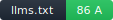

# Convex Documentation



Category: **data** · [Live llms.txt](https://docs.convex.dev/llms.txt) · Snapshot: [`llms.txt`](./llms.txt) · Machine-readable: [`score.json`](./score.json)

**H1:** Convex Documentation

> For general information about Convex, read [https://www.convex.dev/llms.txt](https://www.convex.dev/llms.txt).

**File facts:** 37.4 KB · 31 `## sections` · 342 links (342 after low-value discount) · Freshness: unknown (no `Last-Modified` header).

## Scorecard

| Criterion | Score | Notes |
|---|---:|---|
| Spec compliance | 18/18 | |
| Coverage | 20/20 | |
| Agent-action declarations | 11/14 | _no_llms_full_link_ |
| Linked-content stability | 6/10 | _not_sampled_ |
| Freshness | 5/10 | _no_last_modified_header_ |
| Discoverability | 8/8 | |
| Auth signposting | 8/8 | |
| Size discipline | 4/6 | |
| Content-Type & encoding | 4/4 | |
| Voice | 2/2 | |

## What's exceptional

- Spec compliance (18/18)
- Coverage (20/20)
- Discoverability (8/8)
- Auth signposting (8/8)
- Content-Type & encoding (4/4)
- Voice (2/2)


## Embed the badge

```markdown
[](https://github.com/agentrhq/awesome-llms-txt/tree/main/sites/docs.convex.dev)
```

## Reproduce this score

```bash
npx llms-txt-score https://docs.convex.dev/llms.txt
```

See [the rubric](../../RUBRIC.md) for what each criterion checks.
